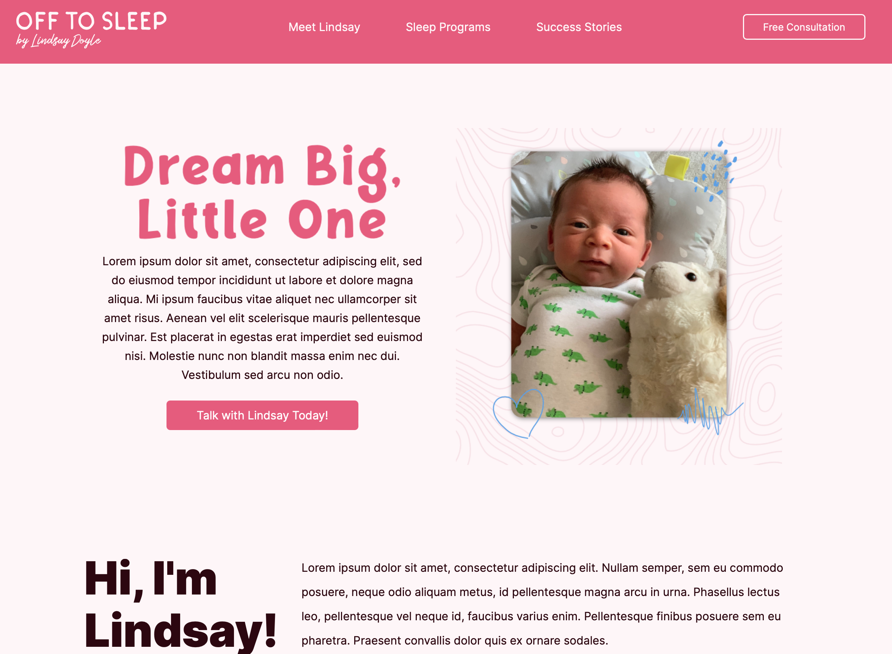
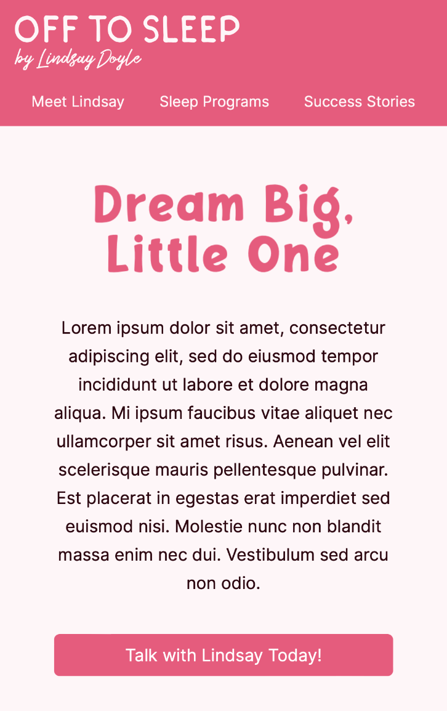

# Off to Sleep by Lindsay Doyle | Sleep Coach | Business Website

## Overview
Business website for a toddler and infant sleep coach. I created a design using Figma to match the care that my client gives to each of her customers.

## How It's Made:
**Tech used:** HTML, CSS, CSS FlexBox, CSS Grid

## Lessons Learned:
Communication is key when working with clients. I gave my client a weekly update on Sunday with the work I had done during the week. This also allowed my client to make changes early in the project so that there were not any major revisions needed at the end.

Comfortable with Flexbox, I wanted to learn CSS Grid with this project. The collage of photos on the homepage was a perfect opportunity to showcase the power of CSS Grid (especially when changing the structure of the collage at smaller screen sizes).

## Screenshots
### GIF

### Desktop

### Mobile
